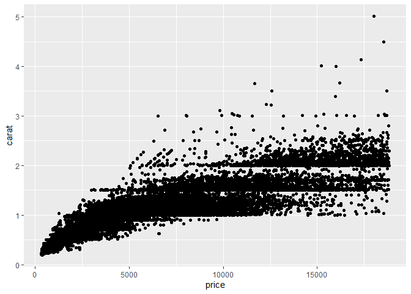
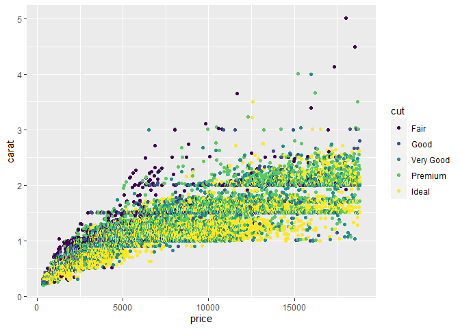

Getting Started: Diamonds
================
(Your name here)
2021-Sept-9

-   [Grading Rubric](#grading-rubric)
    -   [Individual](#individual)
    -   [Team](#team)
    -   [Due Date](#due-date)
-   [Data Exploration](#data-exploration)
    -   [**q1** Create a plot of `price` vs `carat` of the `diamonds`
        dataset below. Document your observations from the
        visual.](#q1-create-a-plot-of-price-vs-carat-of-the-diamonds-dataset-below-document-your-observations-from-the-visual)
    -   [**q2** Create a visualization showing variables `carat`,
        `price`, and `cut` simultaneously. Experiment with which
        variable you assign to which aesthetic (`x`, `y`, etc.) to find
        an effective
        visual.](#q2-create-a-visualization-showing-variables-carat-price-and-cut-simultaneously-experiment-with-which-variable-you-assign-to-which-aesthetic-x-y-etc-to-find-an-effective-visual)
-   [Communication](#communication)
    -   [**q3** *Knit* your document in order to create a
        report.](#q3-knit-your-document-in-order-to-create-a-report)
    -   [**q4** *Push* your knitted document to
        GitHub.](#q4-push-your-knitted-document-to-github)
    -   [**q5** *Prepare* to present your team’s
        findings!](#q5-prepare-to-present-your-teams-findings)

*Purpose*: Throughout this course, you’ll complete a large number of
*exercises* and *challenges*. Exercises are meant to introduce content
with easy-to-solve problems, while challenges are meant to make you
think more deeply about and apply the content. The challenges will start
out highly-scaffolded, and become progressively open-ended.

In this challenge, you will go through the process of exploring,
documenting, and sharing an analysis of a dataset. We will use these
skills again and again in each challenge.

<!-- include-rubric -->

# Grading Rubric

<!-- -------------------------------------------------- -->

Unlike exercises, **challenges will be graded**. The following rubrics
define how you will be graded, both on an individual and team basis.

## Individual

<!-- ------------------------- -->

| Category    | Needs Improvement                                                                                                | Satisfactory                                                                                                               |
|-------------|------------------------------------------------------------------------------------------------------------------|----------------------------------------------------------------------------------------------------------------------------|
| Effort      | Some task **q**’s left unattempted                                                                               | All task **q**’s attempted                                                                                                 |
| Observed    | Did not document observations, or observations incorrect                                                         | Documented correct observations based on analysis                                                                          |
| Supported   | Some observations not clearly supported by analysis                                                              | All observations clearly supported by analysis (table, graph, etc.)                                                        |
| Assessed    | Observations include claims not supported by the data, or reflect a level of certainty not warranted by the data | Observations are appropriately qualified by the quality & relevance of the data and (in)conclusiveness of the support      |
| Cowardice   | Uses the phrase “more data are necessary” without clarification                                                  | Any statement that “more data are necessary” specifies which *specific* data are needed to answer what *specific* question |
| Code Styled | Violations of the [style guide](https://style.tidyverse.org/) hinder readability                                 | Code sufficiently close to the [style guide](https://style.tidyverse.org/)                                                 |

## Team

<!-- ------------------------- -->

| Category   | Needs Improvement                                                                                   | Satisfactory                                                              |
|------------|-----------------------------------------------------------------------------------------------------|---------------------------------------------------------------------------|
| Documented | No team contributions to Wiki                                                                       | Team contributed observations to Wiki                                     |
| Referenced | No team references in Wiki                                                                          | At least one reference in Wiki to member report(s)                        |
| Relevant   | References unrelated to observations, or difficult to find related analysis based on reference text | Reference text clearly points to relevant analysis with active hyperlinks |

## Due Date

<!-- ------------------------- -->

All the deliverables stated in the rubrics above are due **at midnight**
before the day of the class discussion of the challenge. See the
[Syllabus](https://docs.google.com/document/d/1jJTh2DH8nVJd2eyMMoyNGroReo0BKcJrz1eONi3rPSc/edit?usp=sharing)
for more information.

``` r
library(tidyverse)
```

    ## Warning in as.POSIXlt.POSIXct(Sys.time()): unable to identify current timezone 'H':
    ## please set environment variable 'TZ'

    ## -- Attaching packages --------------------------------------- tidyverse 1.3.1 --

    ## v ggplot2 3.3.5     v purrr   0.3.4
    ## v tibble  3.1.4     v dplyr   1.0.7
    ## v tidyr   1.1.3     v stringr 1.4.0
    ## v readr   2.0.1     v forcats 0.5.1

    ## -- Conflicts ------------------------------------------ tidyverse_conflicts() --
    ## x dplyr::filter() masks stats::filter()
    ## x dplyr::lag()    masks stats::lag()

# Data Exploration

<!-- -------------------------------------------------- -->

In this first stage, you will explore the `diamonds` dataset and
document your observations.

### **q1** Create a plot of `price` vs `carat` of the `diamonds` dataset below. Document your observations from the visual.

*Hint*: We learned how to do this in `e-vis00-basics`!

``` r
library(tidyverse)
```

``` r
## TASK: Plot `price` vs `carat` below
## Your code here!
ggplot(data = diamonds) + 
  geom_point(mapping = aes(x = price, y = carat))
```

<!-- -->

**Observations**:

-   price and carat have a positive correlation
-   there are many diamonds that have whole number carats (you can see
    horizontal lines)
-   the outliers are usually higher in carats

### **q2** Create a visualization showing variables `carat`, `price`, and `cut` simultaneously. Experiment with which variable you assign to which aesthetic (`x`, `y`, etc.) to find an effective visual.

``` r
## TASK: Plot `price`, `carat`, and `cut` below
## Your code here!

ggplot(data = diamonds) +
  geom_point(mapping = aes(x = price, y = carat, color = cut))
```

<!-- -->

**Observations**:

-   Cut and price have a positive correlation
-   the outliers that was mentioned in the previous exercise show to
    have worse cuts

# Communication

<!-- -------------------------------------------------- -->

In this next stage, you will render your data exploration, push it to
GitHub to share with others, and link your observations within our [Data
Science
Wiki](https://olin-data-science.fandom.com/wiki/Olin_Data_Science_Wiki).

### **q3** *Knit* your document in order to create a report.

You can do this by clicking the “Knit” button at the top of your
document in RStudio.


This will create a local `.md` file, and RStudio will automatically open
a preview window so you can view your knitted document.

### **q4** *Push* your knitted document to GitHub.


You will need to stage both the `.md` file, as well as the `_files`
folder. Note that the `_files` folder, when staged, will expand to
include all the files under that directory.


### **q5** *Prepare* to present your team’s findings!
